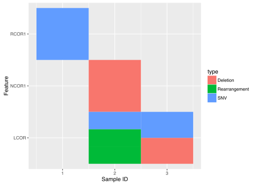

<!-- README.md is generated from README.Rmd. Please edit that file -->
cofeatureR
==========

cofeatureR is an R Package that provides functions for plotting cofeature matrices (aka. sample-feature matrices). For example:



Some features include:

-   Multiple types can be specified for a sample-feature
-   Custom colors for each type
-   Custom ordering of features and samples

Installation
============

To get the released version from CRAN:

``` r
install.packages("cofeatureR")
```

To install the latest developmental version from github:

``` r
devtools::install_github("tinyheero/tinyutils")
```
