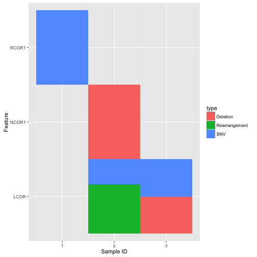

<!-- README.md is generated from README.Rmd. Please edit that file -->
coFeatureR is an R Package that provides functions for plotting CoFeature Matrices. For example:

``` r
library("cofeatureR")
v1 <- c("RCOR1", "NCOR1", "LCOR", "RCOR1", "RCOR1", "RCOR1", "RCOR1")
v2 <- c("sampleA", "sampleC", "sampleB", "sampleC", "sampleA", "sampleC", "sampleC")
v3 <- c("Deletion", "Deletion", "SNV", "Rearrangement", "SNV", "Rearrangement", "SNV")
feature.order <- c("RCOR1", "NCOR1", "LCOR")
sample.id.order <- c("sampleA", "sampleB", "sampleC")
in.df <- dplyr::data_frame(feature = v1, sampleID = v2, type = v3)
fill.colors <- c("Deletion" = "Blue", "Rearrangement" = "Green", "SNV" = "Red")
 
plot_cofeature_mat(in.df)
#> Detected no feature.order. Specifying feature.order
#> Detected no sample.id.order. Specifying sample.id.order
#> Detected no type.order. Specifying type.order
#> Setting feature order
#> Setting sample order
```



\# Installation
===============

To install the latest developmental version from github:

``` r
devtools::install_github("tinyheero/tinyutils")
```
