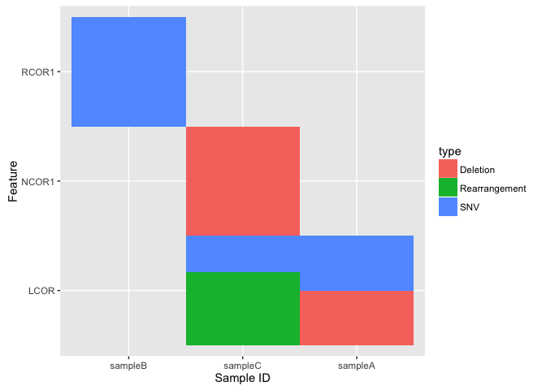
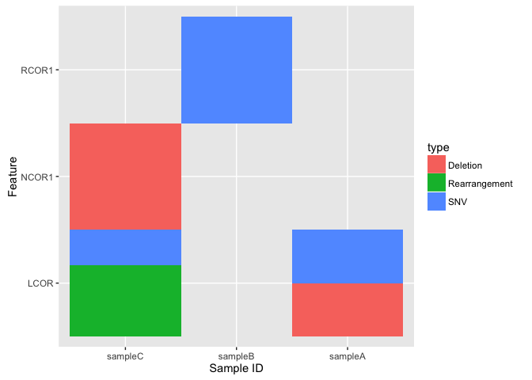
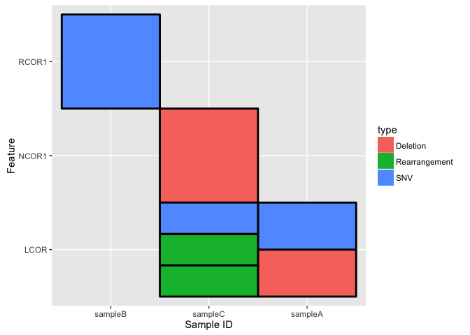

<!-- README.md is generated from README.Rmd. Please edit that file -->
cofeatureR
==========

[](http://cran.r-project.org/package=cofeatureR)

cofeatureR is an R Package that provides functions for plotting cofeature matrices (aka. feature-sample matrices). For example:


Some features include:

-   Multiple types can be specified for a feature-sample
-   Custom colors for each type
-   Custom ordering of features and samples

Installation
============

To get the released version from CRAN:

``` r
install.packages("cofeatureR")
```

To install the latest developmental version from github:

``` r
devtools::install_github("tinyheero/cofeatureR")
```

How to Use
==========

The main function of cofeatureR is the `plot_cofeature_mat` function. It will produce a matrix plot (feature x sample) showing how the different "types" correlate between samples and features. This function only has one required input which is a data.frame containing 3 columns:

-   feature: Feature name
-   sampleID: Sample name
-   type: Type associated with the feature-sample.

For instance in the field of cancer genomics, we are often interested in knowing how differents mutations (type) in different samples (sampleID) correlate between different genes (feature). The input data.frame would have this format:

``` r
library("cofeatureR")
v1 <- c("RCOR1", "NCOR1", "LCOR", "RCOR1", "RCOR1", "RCOR1", "RCOR1")
v2 <- c("sampleA", "sampleC", "sampleB", "sampleC", "sampleA", "sampleC", "sampleC")
v3 <- c("Deletion", "Deletion", "SNV", "Rearrangement", "SNV", "Rearrangement", "SNV")

in.df <- dplyr::data_frame(feature = v1, sampleID = v2, type = v3)
knitr::kable(in.df)
```

| feature | sampleID | type          |
|:--------|:---------|:--------------|
| RCOR1   | sampleA  | Deletion      |
| NCOR1   | sampleC  | Deletion      |
| LCOR    | sampleB  | SNV           |
| RCOR1   | sampleC  | Rearrangement |
| RCOR1   | sampleA  | SNV           |
| RCOR1   | sampleC  | Rearrangement |
| RCOR1   | sampleC  | SNV           |

This input data.frame can now be used as input into `plot_cofeature_mat`:

``` r
plot_cofeature_mat(in.df)
```



Notice how we are NOT restricted to have only one type per feature-sample. In other words, a feature-sample may have multiple types and `plot_cofeature_mat` will display all of the types.

Specifying the Order of Samples and Features
--------------------------------------------

You can control the order of the samples (columns) and features (rows) by making use of the `feature.order` and `sample.id.order` parameters. You just need to specify a character vector listening the order:

``` r
feature.order <- c("RCOR1", "NCOR1", "LCOR")
sample.id.order <- c("sampleA", "sampleB", "sampleC")
plot_cofeature_mat(in.df, feature.order = feature.order, 
                   sample.id.order = sample.id.order)
```



Changing the Type Colors
------------------------

You can control the type colors by using the `fill.colors` parameter. You need to specify a named character vector with the name as the type and the value as the color you want the type to be. For instance:

``` r
fill.colors <- c("Deletion" = "Blue", "Rearrangement" = "Green", "SNV" = "Red")
plot_cofeature_mat(in.df, fill.colors = fill.colors)
```


Adding Borders
--------------

To add a border around the types (makes it easier to visualize the types), we can use the `tile.col` parameter:

``` r
plot_cofeature_mat(in.df, tile.col = "black")
```


